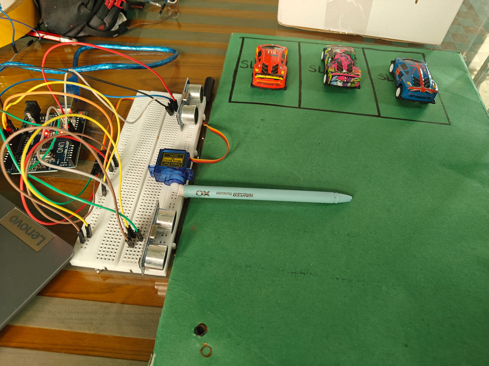

# 🚗 Smart Parking System using Arduino

An Arduino-based **Smart Parking System** designed to automate vehicle entry and exit management for a parking lot with a capacity of **three vehicles**. The system uses **two ultrasonic sensors** to detect incoming and outgoing vehicles and a **servo motor** to control the barrier gate based on parking availability.

---

## 📌 Features

- 🚘 Automatic vehicle detection at the entrance
- 🚪 Servo-controlled barrier gate
- 🅿️ Real-time occupancy management for **3 parking slots**
- 🚗 Automatic vehicle exit detection
- 🔒 Prevents entry when the parking lot is full
- ⚡ Low-cost and easy-to-build prototype
- 🏙️ Demonstrates concepts used in Smart City parking solutions

---

## 🛠 Hardware Components

| Component | Quantity |
|-----------|----------|
| Arduino Uno | 1 |
| HC-SR04 Ultrasonic Sensor | 2 |
| SG90 Servo Motor | 1 |
| Breadboard | 1 |
| Jumper Wires | Several |
| USB Cable / 5V Supply | 1 |

---

## ⚙️ Working Principle

### Vehicle Entry
An ultrasonic sensor placed near the entrance continuously monitors approaching vehicles.

- If the number of occupied slots is less than **3**, the servo motor opens the barrier gate.
- After the vehicle enters, the occupancy count is increased by one.
- The gate then closes automatically.

### Vehicle Exit
A second ultrasonic sensor is positioned near the exit.

- When a vehicle is detected leaving the parking lot, the occupancy count is decreased by one.
- The parking lot becomes available for another incoming vehicle.

### Parking Capacity
The parking system supports a maximum of **3 vehicles**.

| Occupied Slots | Available Slots |
|---------------|----------------|
| 0 | 3 |
| 1 | 2 |
| 2 | 1 |
| 3 | 0 |

---

## 🔌 Pin Connections

| Device | Arduino Pin |
|--------|-------------|
| Entry Ultrasonic TRIG | D9 |
| Entry Ultrasonic ECHO | D10 |
| Exit Ultrasonic TRIG | D7 |
| Exit Ultrasonic ECHO | D8 |
| Servo Signal | D6 |
| VCC | 5V |
| GND | GND |

---

## 🚀 System Flow

```text
Vehicle Approaches Entrance
            │
            ▼
Entry Ultrasonic Detects Vehicle
            │
            ▼
Occupied Slots < 3 ?
      ┌─────┴─────┐
      │           │
     Yes          No
      │           │
      ▼           ▼
Open Gate    Keep Gate Closed
      │
      ▼
Vehicle Enters
      │
      ▼
Occupied Count++
      │
      ▼
Close Gate


Vehicle Approaches Exit
            │
            ▼
Exit Ultrasonic Detects Vehicle
            │
            ▼
Occupied Count--
            │
            ▼
Parking Slot Available
```

---

## 📷 Project Demonstration

### Barrier Closed
The barrier gate remains closed when no vehicle is detected or when all parking slots are occupied.



---

### Barrier Open
The barrier gate opens automatically when an incoming vehicle is detected and parking space is available.


---

### Circuit Wiring
Wiring connections between the Arduino Uno, ultrasonic sensors, servo motor, and breadboard.


---

### Complete Hardware Setup
Complete prototype of the Smart Parking System showing the parking area, sensors, gate mechanism, and controller setup.


---

## 🎯 Applications

- Shopping Malls
- Residential Complexes
- Office Buildings
- Educational Institutions
- Smart City Parking Systems

---

## 🔮 Future Enhancements

- LCD display for available parking spaces
- RFID-based authentication
- ESP32 Wi-Fi connectivity
- Mobile application integration
- Cloud-based parking monitoring
- Support for multiple entry and exit lanes

---

## 👨‍💻 Authors

Developed as an Arduino-based embedded systems project demonstrating:

- Sensor Interfacing
- Servo Motor Control
- Occupancy Management
- Embedded Programming
- Automation Techniques
- Smart Parking Concepts

⭐ If you found this project useful, consider giving it a star!
